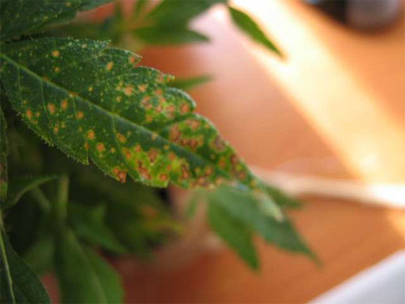

# Carenza di Calcio \(Ca\)

La carenza di Calcio in una pianta può influenzare il **suolo** facendolo diventare **troppo acido**. È molto abbondante in natura e si trova in forma di calcare \(CaCO3\), le sue eventuali carenze si possono riscontrare dunque in suoli acidi. Sulle foglie si possono osservare **deformazioni** e **clorosi internervali**, oltre che disseccamenti degli apici vegetativi e dei margini fogliari.

* Clorosi delle foglie giovani, seguita da necrosi e caduta
* Colore delle foglie opaco, ingiallimento
* Foglie deformate
* Curvatura e appassimento dei lembi fogliari

### **Cura da carenza**

Fertilizzare con concime a rapido assorbimento come il [Mono Calcio 15%](https://www.idroponica.it/canna-mono-calcio-1l~20932.html). Altra fonte di Calcio sono [Cal-Mag Extra](https://www.idroponica.it/advanced-nutrients-sensi-calmag-xtra-1l~26326.html) e [Bio Nova Calcio](https://www.idroponica.it/bionova-calcio-15-250-ml~1069.html).

### Eccesso di Calcio

Basificazione del suolo, con conseguenti carenze di K, N, Mg, clorosi ferrica con necrosi delle foglie. L'eccesso si manifesta, soprattutto nelle specie acidofile, con ingiallimento delle foglie.

