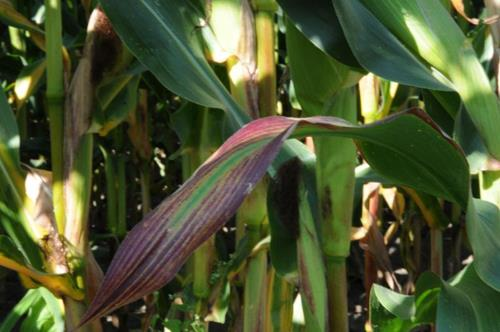

# Carenza di Fosforo \(P\)

Le **piante con carenza di Fosforo** hanno una **crescita rallentata**. Le foglie sono **piccole, verde bluastro e spesso con macchie**. Gli steli, le foglie e le nervature diventano rossastri a partire dai bordi e dal retro. L'arrossamento però non sempre è pronunciato. Le **foglie vecchie diventano scure e arricciate e i bordi si incurvano**. Se la carenza è grave le foglie sviluppano grandi macchie viola scuro che diventano poi bronzee, secche raggrinzite e cadono. La carenza si aggrava in suoli argillosi o acidi, e quella più comune è quando il substrato ha un livello di pH superiore a 7. Con un livello di pH sotto a 5,8 e con eccessi di zinco e ferro, i fosfati risultano non assimilabili dalla pianta.

* Clorosi lungo le nervature fogliari \(a partire dalle foglie giovani\)
* Le foglie diventano bronzo-porpora, raggrinziscono e muoiono
* Foglie verde-bluastro scuro spesso con macchie scure
* Crescita stentata

### **Cura da carenza**

Fertilizzare con concimi a rapido assorbimento come il [P 20%](https://www.idroponica.it/bionova-p-20-con-fosforo~25822.html). I risultati si vedono in 4-5 giorni. Altra fonte di fosforo è il [GK Complete Mix](https://www.idroponica.it/gk-organics-complete-organics~26077.html).

### Eccesso di Fosforo

Le piante sono molto sensibili alle malattie e muffe, vi è una crescita inusuale degli apicali. Le piante possono metterci settimane a manifestare l'eccesso. Si manifesta anche come carenza di zinco.

