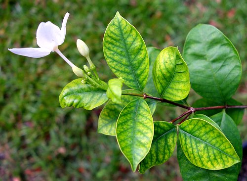

# Carenze nutrizionali

È fondamentale **prevenire le carenze nutrizionali nelle piante** apportando regolarmente la **giusta dose di concime** e scegliendo i **fertilizzanti più adatti** sulla base delle specifiche esigenze nutrizionali, variabili a seconda della specie, della varietà e dello _stadio fenologico_ di sviluppo \(crescita, fioritura, ecc.\).

Le cause delle carenze possono essere di diverso tipo:

* Parassiti
* Scarsa efficenza dell'apparato radicale
* Mancanza di elementi nutritivi

### Parassiti

A volte **una carenza è una conseguenza di una infestazioni di parassiti** e prima di adoperarsi per sostentare la pianta e riportarla ad uno stato di piena salute occorre lavorare su una possibile infestazione di parassiti.

### Scarsa efficenza dell'apparato radicale

Lo **squilibrio di nutrienti nelle piante** provoca sintomi più o meno accentuati e caratteristici, a seconda dell’elemento presente in quantità insufficienti. La sintomatologia, però, non è sempre da ricondurre ad una vera e propria **carenza di elementi nutritivi:** i problemi infatti potrebbero derivare da uno scarso assorbimento dovuto, ad esempio, ad un apparato radicale poco efficiente, alla presenza di forme insolubili o alle caratteristiche del suolo, così come a molti altri fattori più o meno complessi.

### Elementi nutritivi

La **mancanza** di uno solo degli **elementi nutritivi** prima elencati produce tutta una serie di **sintomi di carenza** che, se prolungati nel tempo, portano all'arresto della crescita e, infine, alla **morte della pianta**. Le carenze nutritive colpiscono tutte le piante, sia quelle dell'orto che del giardino, indoor e outdoor. La diagnosi di una patologia è una questione delicata e non bisogna soffermarsi alla superficialità di un singolo sintomo. Generalemnte la carenza nutrizionale si evidenzia sulla pianta con manifestazioni a carico delle foglie \(anche nel lato inferiore\), dei fiori, dei gambi, dei frutti e del portamento generale. Tuttavia non sempre i sintomi sono subito identificabili. Per tale motivo **si consigliano sempre concimi completi di microelementi**, mentre se **la carenza è da curare si devono utilizzare prodotti specifici** \(es. Mono-componente\).

### Macro nutrienti

Sono elementi **richiesti in grande quantità per la crescita e lo sviluppo delle piante**. Si tratta principalmente di **azoto, fosforo e potassio**, che troviamo in tutti i generici **mix di fertilizzanti** **per piante verdi** in commercio \(i classici “**N-P-K**“\).  Altri macronutrienti sono lo **zolfo, il magnesio e il calcio.** Per garantire alle nostre piante un apporto adeguato di questi elementi, è fondamentale regolare la concimazione sulla base delle effettive necessità e dello stadio vegetativo: possiamo tenere presente che l’**azoto deve essere più abbondante durante la fase di crescita vegetativa**, insieme al **fosforo** necessario per la **fioritura**; il **potassio** invece è utile alla maturazione dei **frutti**.

### Micro nutrienti

Sono richiesti dalle piante a dosi nettamente inferiori: per questo motivo sono in genere **sufficienti le quantità già presenti nel terreno** o comunemente apportate con la **concimazione minerale e/o organica**. Tuttavia si possono verificare situazioni particolari che comportano la loro carenza, ad esempio in terreni alcalini/calcarei o con scarsa sostanza organica: in tal caso è importante intervenire tempestivamente con una **concimazione equilibrata**. I micronutrienti per le piante sono **molibdeno, ferro, manganese, boro, zinco, rame, silicio e cloro.**

### **P**osizione dei sintomi per distinguere le carenze nutrizionali

I **sintomi delle carenze nutrizionali** nelle piante sono a volte confusi con quelli provocati da altri fattori, che possono essere presenti in contemporanea o anche essere la concausa della manifestazione. Inoltre, a volte risulta **difficile distinguere i sintomi di una specifica carenza nutritiva** dalle altre; diventa dunque necessario ricorrere ad una “diagnosi complessiva” di tutti i segnali che la pianta manifesta quando si trova in condizioni di **squilibrio nutrizionale**.

Un importante fattore che da tenere in considerazione per **riconoscere le carenze nutritive nelle piante** e quindi procedere ad una **corretta concimazione**, è il **grado di** **mobilità degli elementi nutritivi.**

In base a questa caratteristica possiamo distinguere gli elementi necessari alla nutrizione delle piante in **mobili** e **non mobili.**  I nutrienti mobili \(come **N, P e K**\) riescono a spostarsi facilmente da foglia a foglia, quindi, in caso di **carenza di azoto, di fosforo o di potassio** i sintomi si osserveranno prima sulle **foglie più vecchie**. Se la mancanza riguarda invece elementi non mobili \(come calcio, ferro, zolfo e rame\), invece, i sintomi si manifesteranno sulle **foglie più giovani**.

* Estratto da un [articolo di ecoprospettive.com](https://ecoprospettive.com/concimazione-come-riconoscere-le-carenze-nutrizionali-nelle-piante/) scritto da [Anna Mastellaro](https://ecoprospettive.com/author/anna-mastellaro/);

