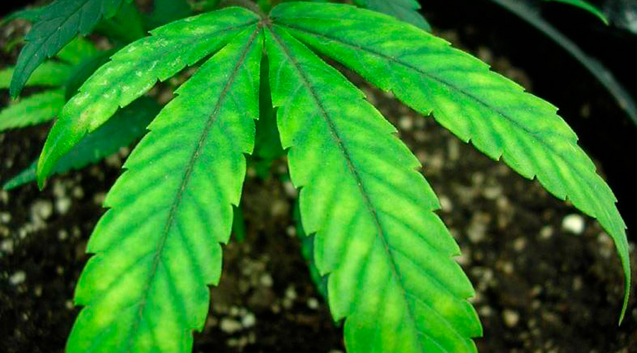

# Carenza di Magnesio \(Mg\)

Nelle piante è **resa evidente solitamente nel mezzo della pianta o nelle foglie più basse**, poi si diffonde verso le foglie più giovani. Le foglie diventano gialle o bianche con venature che rimangono di un verde scuro: questi gli indicatori più evidenti di una mancanza di magnesio. Le foglie più basse e quelle di mezzo sviluppano delle **chiazze gialle** tra le venature verde scuro. I **margini fogliari si piegano** prima che la foglia cada. La pianta **può ingiallire nel giro di poche settimane** e se è grave diventa completamente bianca. La carenza di magnesio **non è comune nelle coltivazioni outdoor**.

* **Clorosi a chiazze** a partire dalle foglie vecchie
* **Perdita precoce** delle **foglie** più **vecchie**
* **Ripiegamento verso l’alto** dei margini fogliari
* **Chiazze giallognole** o violacee sulla lamina fogliare

### **Cura da carenza**

Fertilizzare con concime idrosolubile a rapido assorbimento come il [MgO 8%](https://www.idroponica.it/bionova-mgo-8-con-magnesio~25856.html). I risultati si vedono in 2-4 giorni. Altra fonte di Magnesio \(con Calcio, Ferro e altri microelementi\) è il [Cal-Mag Extra](https://www.idroponica.it/advanced-nutrients-sensi-calmag-xtra-1l~26326.html).

### Eccesso di elemento

Raramente si assiste ad un eccesso di Magnesio, inoltre è difficile da diagnosticare ad occhio nudo.

