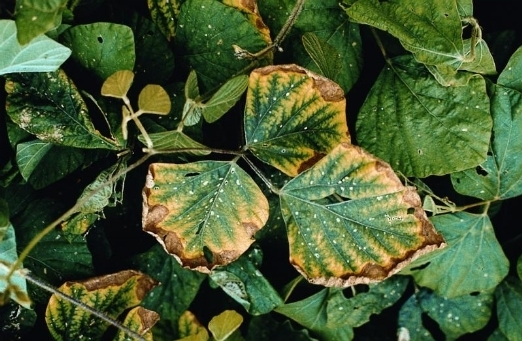

# Carenza di Potassio \(K\)

**Avviene occasionalmente** sia nei substrati di coltivazione indoor che all'aperto in terreno, ma raramente nelle coltivazioni idroponiche. **La pianta con carenza di potassio sviluppa sulle foglie dei bordi gialli** e **macchie clorotiche** \(simili alla carenza di calcio ma solo sul bordo fogliare\), le **foglie basse muoiono** o diventano marrone chiaro. La pianta diventa suscettibile alle malattie. Il potassio è di solito presente nel suolo però spesso è bloccato dall'alta salinità del substrato stesso. Aumenta la temperatura interna delle foglie causando il degrado delle proteine delle cellule. L'eccessiva evaporazione dai margini fogliari causa bruciature rosse associate a steli dello stesso colore.

* Le **foglie vecchie perdono lucentezza** e sviluppano macchie rugginose
* I **margini fogliari** diventano **secchi**, **marroni** e si **sollevano**
* **Fioritura ritardata** e molto **ridotta**
* I **rami** e i **gambi** diventano molto **sottili**

### Cura da carenza

Fertilizzare con concime a rapido assorbimento come il [K 20%](https://www.idroponica.it/bionova-p-20-con-fosforo~25822.html). I risultati si vedono in 2-4 giorni. Altre fonti di Potassio sono il [GK Complete Mix](https://www.idroponica.it/gk-organics-complete-organics~26077.html) e il [Rhino Skin](https://www.idroponica.it/advanced-nutrients-rhino-skin~25667.html).

### Eccesso di elemento

E' difficile da diagnosticare, in genere le **foglie diventano di colore giallo accesso fino a bianco**. Quando l'assorbimento di magnesio, manganese - e a volte di Zinco e Ferro - è lento o nullo, quasi sempre c'è un eccesso di potassio. L'eccesso si tratta con una leggera concimazione con gli altri microelementi.

