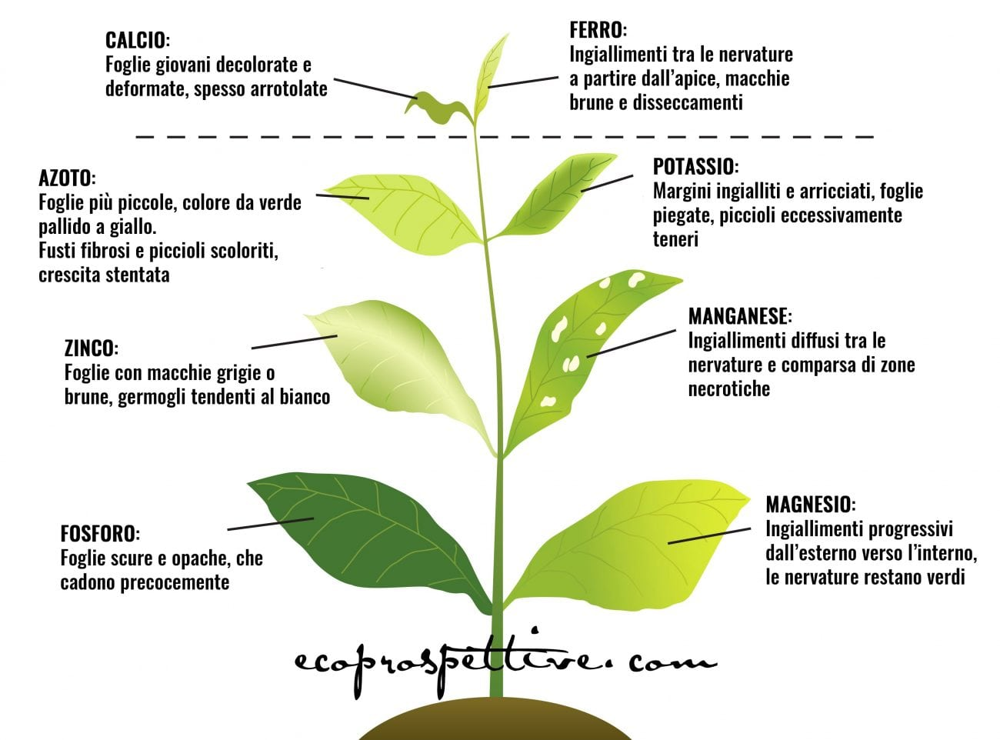

# Sintomi generali

Queste descrizioni sono indicative, in quanto i sintomi possono variare a seconda della specie considerata, della sensibilità della pianta e del suo stadio di sviluppo.

## Elementi mobili

Gli elementi mobili \(come **N, P e K**\) riescono a spostarsi facilmente da foglia a foglia, quindi, in caso di **carenza di azoto, di fosforo o di potassio** i sintomi si osserveranno prima sulle **foglie più vecchie**

## Elementi non mobili

Se la mancanza riguarda invece elementi non mobili \(come calcio, ferro, zolfo e rame\), invece, i sintomi si manifesteranno sulle **foglie più giovani**.

* Estratto da un [articolo di ecoprospettive.com](https://ecoprospettive.com/concimazione-come-riconoscere-le-carenze-nutrizionali-nelle-piante/) scritto da [Anna Mastellaro](https://ecoprospettive.com/author/anna-mastellaro/);
* Estratto da un [articolo di idroponica.it](https://www.idroponica.it/carenze-nutrizionali-piante-indoor-outdoor_28-175.html).

