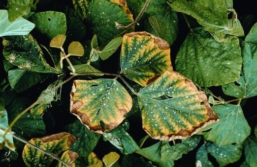

# Sintomi generali

Queste descrizioni sono indicative, in quanto i sintomi possono variare a seconda della specie considerata, della sensibilità della pianta e del suo stadio di sviluppo.

## Elementi mobili

Gli elementi mobili \(come **N, P e K**\) riescono a spostarsi facilmente da foglia a foglia, quindi, in caso di **carenza di azoto, di fosforo o di potassio** i sintomi si osserveranno prima sulle **foglie più vecchie**

### Carenza di Azoto \(N\)

**Le piante con carenza di Azoto** \(elemento mobile\) hanno una **crescita rallentata**, le foglie più vecchie non possono produrre clorofilla e **diventano gialle tra le nervature, mentre le nervature restano verdi**. L'ingiallimento prosegue sull'intera foglia fino a farla cadere. Alle volte le foglie e i rami possono diventare rossicci, il che porta a _confondere la carenza di azoto con la carenza di fosforo_. Crescita lenta e stentata, **foglie di colore da verde pallido a giallo**, di piccole dimensioni. L’ingiallimento inizia a partire dall’apice delle foglie basali e può coinvolgere anche i piccioli. Potrebbero verificarsi la caduta dei fiori e la mancata formazione dei frutti.

* Foglie vecchie e ingiallimento tra le venature che può estendersi gradualmente
* Rami e venature delle foglie possono diventare rosso-porpora
* Le foglie giovani sviluppano una clorosi intervenale
* Caduta delle foglie

#### Mantenimento

L'azoto è un elemento molto mobile e viene consumato velocemente, quindi va aggiunto regolarmente tramite **concimi a lenta cessione**.

#### Cura da carenza

Fertilizzare con **concimi a rapido assorbimento**, come Cellmax Bio-Grow. I risultati si vedono in 4-5 giorni. Altre fonti di azoto sono il Bio Nova N 27% e il sangue di bue.

#### Eccesso dell'elemento

Le **foglie diventano verde scuro e tendono ad avere un aspetto lucido**, si racchiudono deformandosi mentre i rami hanno internodi più lunghi. Questo porta la pianta a essere più sensibile agli attacchi di insetti come afidi e ad infezioni di funghi. La pianta assorbe meno acqua. Se è grave le foglie diventano color bronzo-rame. Le radici si sviluppano più lentamente e marciscono. I fiori sono più piccoli e i frutti maturi si spaccano.

### Carenza di Potassio \(K\)

**Avviene occasionalmente** sia nei substrati di coltivazione indoor che all'aperto in terreno, ma raramente nelle coltivazioni idroponiche. **La pianta con carenza di potassio sviluppa sulle foglie dei bordi gialli** e **macchie clorotiche** \(simili alla carenza di calcio ma solo sul bordo fogliare\), le **foglie basse muoiono** o diventano marrone chiaro. La pianta diventa suscettibile alle malattie. Il potassio è di solito presente nel suolo però spesso è bloccato dall'alta salinità del substrato stesso. Aumenta la temperatura interna delle foglie causando il degrado delle proteine delle cellule. L'eccessiva evaporazione dai margini fogliari causa bruciature rosse associate a steli dello stesso colore.

* Le **foglie vecchie perdono lucentezza** e sviluppano macchie rugginose
* I **margini fogliari** diventano **secchi**, **marroni** e si **sollevano**
* **Fioritura ritardata** e molto **ridotta**
* I **rami** e i **gambi** diventano molto **sottili**

#### Cura da carenza

Fertilizzare con concime a rapido assorbimento come il [K 20%](https://www.idroponica.it/bionova-p-20-con-fosforo~25822.html). I risultati si vedono in 2-4 giorni. Altre fonti di Potassio sono il [GK Complete Mix](https://www.idroponica.it/gk-organics-complete-organics~26077.html) e il [Rhino Skin](https://www.idroponica.it/advanced-nutrients-rhino-skin~25667.html).

#### Eccesso dell'elemento

E' difficile da diagnosticare, in genere le **foglie diventano di colore giallo accesso fino a bianco**. Quando l'assorbimento di magnesio, manganese - e a volte di Zinco e Ferro - è lento o nullo, quasi sempre c'è un eccesso di potassio. L'eccesso si tratta con una leggera concimazione con gli altri microelementi.

### Carenza di Magnesio \(Mg\)

Nelle piante è **resa evidente solitamente nel mezzo della pianta o nelle foglie più basse**, poi si diffonde verso le foglie più giovani. Le foglie diventano gialle o bianche con venature che rimangono di un verde scuro: questi gli indicatori più evidenti di una mancanza di magnesio. Le foglie più basse e quelle di mezzo sviluppano delle **chiazze gialle** tra le venature verde scuro. I **margini fogliari si piegano** prima che la foglia cada. La pianta **può ingiallire nel giro di poche settimane** e se è grave diventa completamente bianca. La carenza di magnesio **non è comune nelle coltivazioni outdoor**.

* **Clorosi a chiazze** a partire dalle foglie vecchie
* **Perdita precoce** delle **foglie** più **vecchie**
* **Ripiegamento verso l’alto** dei margini fogliari
* **Chiazze giallognole** o violacee sulla lamina fogliare

## Elementi non mobili

Se la mancanza riguarda invece elementi non mobili \(come calcio, ferro, zolfo e rame\), invece, i sintomi si manifesteranno sulle **foglie più giovani**.

* Estratto da un [articolo di ecoprospettive.com](https://ecoprospettive.com/concimazione-come-riconoscere-le-carenze-nutrizionali-nelle-piante/) scritto da [Anna Mastellaro](https://ecoprospettive.com/author/anna-mastellaro/);
* Estratto da un [articolo di idroponica.it](https://www.idroponica.it/carenze-nutrizionali-piante-indoor-outdoor_28-175.html).

