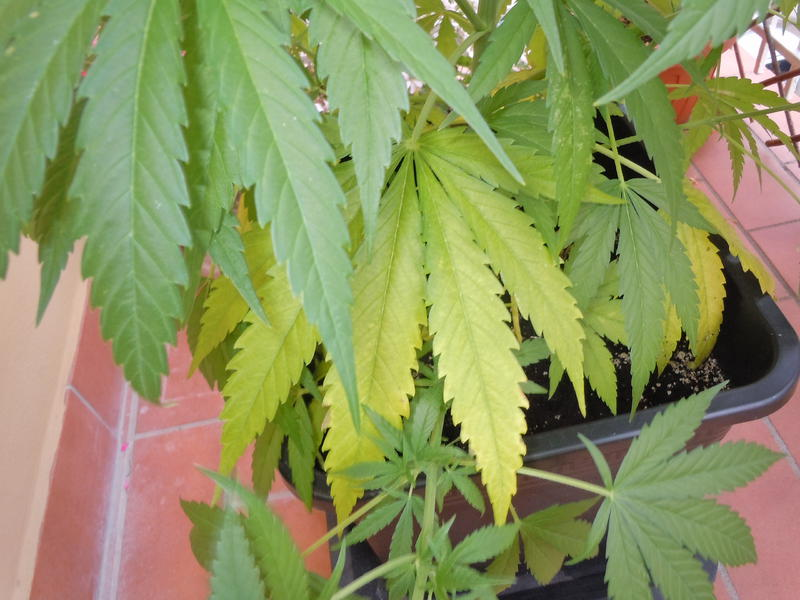

# Carenza di Azoto \(N\)

**Le piante con carenza di Azoto** \(elemento mobile\) hanno una **crescita rallentata**, le foglie più vecchie non possono produrre clorofilla e **diventano gialle tra le nervature, mentre le nervature restano verdi**. L'ingiallimento prosegue sull'intera foglia fino a farla cadere. Alle volte le foglie e i rami possono diventare rossicci, il che porta a _confondere la carenza di azoto con la carenza di fosforo_. Crescita lenta e stentata, **foglie di colore da verde pallido a giallo**, di piccole dimensioni. L’ingiallimento inizia a partire dall’apice delle foglie basali e può coinvolgere anche i piccioli. Potrebbero verificarsi la caduta dei fiori e la mancata formazione dei frutti.

* Foglie vecchie e ingiallimento tra le venature che può estendersi gradualmente
* Rami e venature delle foglie possono diventare rosso-porpora
* Le foglie giovani sviluppano una clorosi intervenale
* Caduta delle foglie

#### Mantenimento

L'azoto è un elemento molto mobile e viene consumato velocemente, quindi va aggiunto regolarmente tramite **concimi a lenta cessione**.

#### Cura da carenza

Fertilizzare con **concimi a rapido assorbimento**, come Cellmax Bio-Grow. I risultati si vedono in 4-5 giorni. Altre fonti di azoto sono il Bio Nova N 27% e il sangue di bue.

#### Eccesso di elemento

Le **foglie diventano verde scuro e tendono ad avere un aspetto lucido**, si racchiudono deformandosi mentre i rami hanno internodi più lunghi. Questo porta la pianta a essere più sensibile agli attacchi di insetti come afidi e ad infezioni di funghi. La pianta assorbe meno acqua. Se è grave le foglie diventano color bronzo-rame. Le radici si sviluppano più lentamente e marciscono. I fiori sono più piccoli e i frutti maturi si spaccano.

