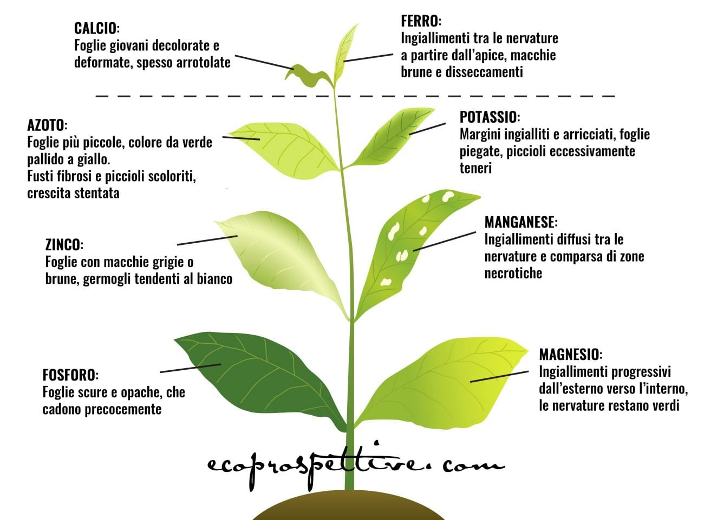

# Sintomi generali

Queste descrizioni sono indicative, in quanto i sintomi possono variare a seconda della specie considerata, della sensibilità della pianta e del suo stadio di sviluppo.

## Elementi mobili

Gli elementi mobili \(come **N, P e K**\) riescono a spostarsi facilmente da foglia a foglia, quindi, in caso di **carenza di azoto, di fosforo o di potassio** i sintomi si osserveranno prima sulle **foglie più vecchie**

### Azoto \(N\)

**Le piante con carenza di Azoto** \(elemento mobile\) hanno una **crescita rallentata**, le foglie più vecchie non possono produrre clorofilla e **diventano gialle tra le nervature, mentre le nervature restano verdi**. L'ingiallimento prosegue sull'intera foglia fino a farla cadere. Alle volte le foglie e i rami possono diventare rossicci, il che porta a _confondere la carenza di azoto con la carenza di fosforo_. L'azoto è un elemento molto mobile e viene consumato velocemente, quindi va aggiunto regolarmente tramite concimi a lenta cessione.



* Foglie vecchie e ingiallimento tra le venature che può estendersi gradualmente
* Rami e venature delle foglie possono diventare rosso-porpora
* Le foglie giovani sviluppano una clorosi intervenale
* Caduta delle foglie

Pianta con crescita lenta e stentata, **foglie di colore da verde pallido a giallo**, di piccole dimensioni. L’ingiallimento inizia a partire dall’apice delle foglie basali e può coinvolgere anche i piccioli. Potrebbero verificarsi la caduta dei fiori e la mancata formazione dei frutti.

## Elementi non mobili

Se la mancanza riguarda invece elementi non mobili \(come calcio, ferro, zolfo e rame\), invece, i sintomi si manifesteranno sulle **foglie più giovani**.

* Estratto da un [articolo di ecoprospettive.com](https://ecoprospettive.com/concimazione-come-riconoscere-le-carenze-nutrizionali-nelle-piante/) scritto da [Anna Mastellaro](https://ecoprospettive.com/author/anna-mastellaro/);
* Estratto da un [articolo di idroponica.it](https://www.idroponica.it/carenze-nutrizionali-piante-indoor-outdoor_28-175.html).

