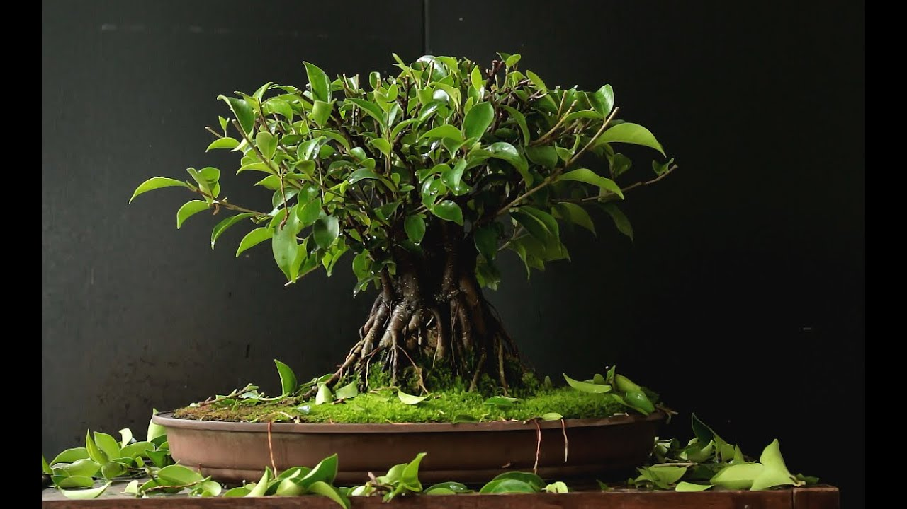

# Introduzione

Il Ficus è il classico bonsai  da interno; riesce a vegetare bene in ambienti poco luminosi, dove altre piante non riuscirebbero a sopravvivere e richiede pochissime cure per vivere in salute. Le  varietà esistenti in natura sono migliaia \(a cominciare dal Fico comune, fino ad arrivare ai Ficus repens rampicanti\) ma quello che viene maggiormente utilizzato nella tecnica bonsai è il **Ficus retusa**.

Il tronco di questo Ficus è robusto e sinuoso, con la corteccia molto chiara, a volte segnata da chiazze bianche orizzontali. Negli esemplari adulti la base del tronco si presenta ricca di radici contorte che suscitano sempre una forte impressione; ma la caratteristica che rende il Ficus unico  tra i bonsai, è quella delle **radici aeree**: le quali partendo dai rami arrivano fino a terra, diventando a loro volta dei tronchi secondari. Le foglie sono ovali, appuntite, di un bel verde intenso, inoltre, a volte è possibile veder fruttificare questa pianta, che produce dei **piccoli fichi** giallognoli.

