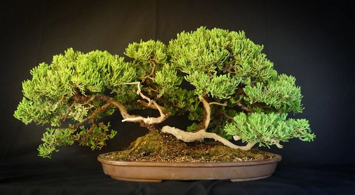

# Introduzione

In Giappone, il Ginepro è una delle piante più utilizzate nell’arte bonsai: i grandi maestri del sol levante, gareggiano nelle prestigiose esposizioni nipponiche portando quasi esclusivamente formidabili esemplari di questa essenza. Il Ginepro infatti, è un Bonsai che permette di creare forme ardite e particolari, sconosciute alle altre essenze. Inoltre, la resistenza alle avversità climatiche e di coltivazione, la rendono **una pianta facile da mantenere**, senza il timore dei “colpi di secco” estivi, o delle forti gelate invernali.

